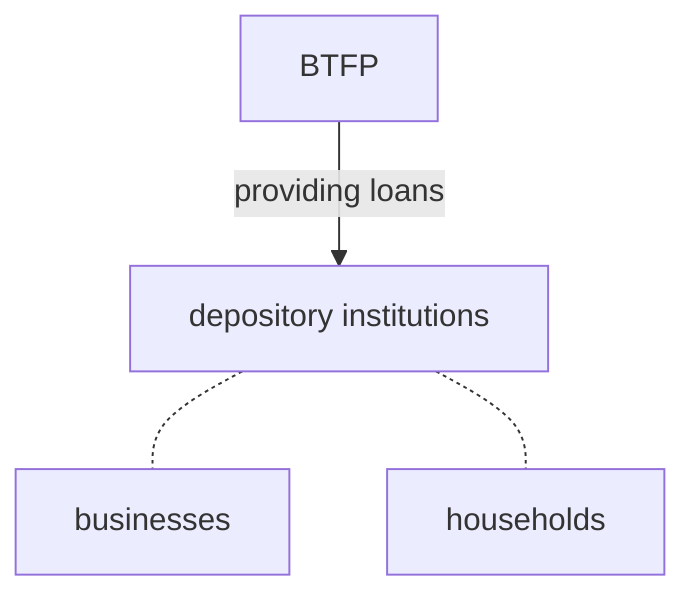

# Bank Term Funding Program(BTFP)

The Bank Term Funding Program (BTFP) is designed to bolster American businesses and households by providing additional financial support to eligible depository institutions. This support aims to ensure that banks are capable of satisfying the requirements of all their depositors. The BTFP accomplishes this by offering loans with a duration of up to one year. These loans are available to a range of depository institutions, including banks, savings associations, credit unions, and others that meet eligibility criteria.

A key feature of the BTFP is the collateral requirement. Eligible depository institutions can secure loans by pledging various types of collateral that are acceptable for purchase by the Federal Reserve Banks in open market operations. This collateral includes assets such as U.S. Treasuries, U.S. agency securities, and U.S. agency mortgage-backed securities, which will be valued at their face (par) value.

One of the primary purposes of the BTFP is to serve as an additional source of liquidity. By accepting high-quality securities as collateral, the program helps institutions avoid the need to rapidly sell these securities during periods of financial stress. This provision aims to enhance financial stability and provide a safety net for eligible institutions, thereby indirectly supporting the broader economy.

