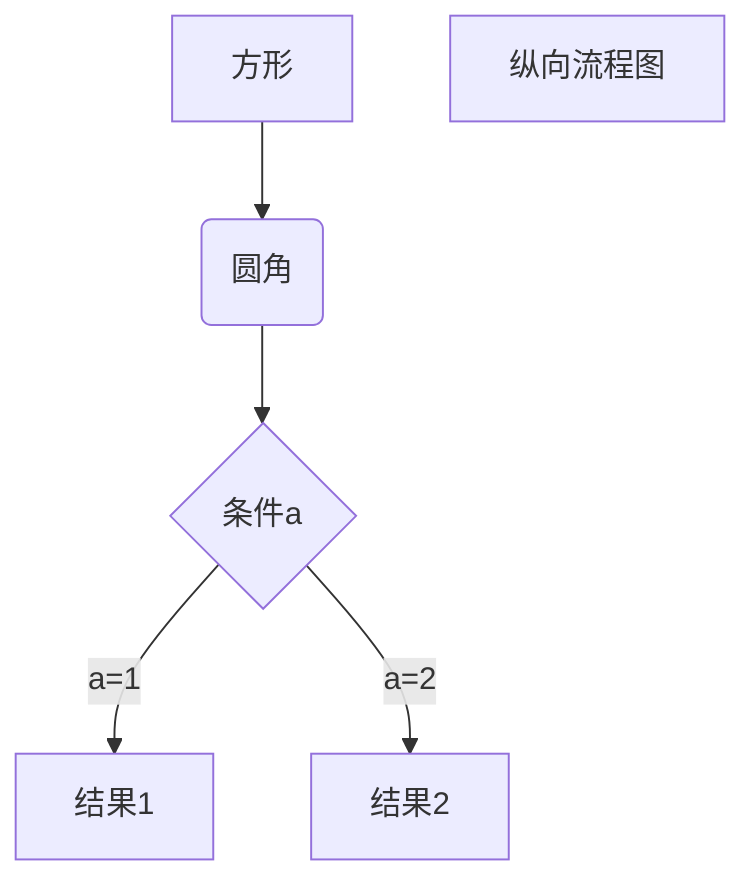

## 货币宽松政策(easymoney policy)

`货币宽松`就是指通过降低利率以提升货币供应的一种政策。
`再贴现率(Rediscount Rate)`


公开市场操作(非借入准备金的变动)
美联储放款(借入准备金的变动)

- `非借入准备金(NBR)`美联储公开市场操作所供给的准备金
- `借入准备金(BR)`向美联储借款所形成的准备金，其主要成本在于美联储会向这些贷款所收取的利率(即贴现率(*i*<font size=21>d</font>))，

资产负债表
准备金规模

货币供给的变动会影响*利率*及*通货膨胀率*
- `利率`
- `通货膨胀率`


准备金市场
债券市场

准备金总额包含：(1) 法定准备金，**法定准备金率**乘以需要缴纳**准备金的存款**；(2) 超额准备金，银行自愿持有的额外的准备金。

机会成本(opportunity cost)

货币供给过程中的三位参与者
`中央银行`。政府机构，监管银行体系，负责实施货币政策。如美国的联邦储备体系
`银行`。金融中介机构(如商业银行、储蓄与贷款协会呢、互助储蓄银行及信用社)，从个人或者机构手中吸收存款或者向他们发放贷款
`储户`。拥有银行存储的个人或者机构

## 美联储的资产负债表
资产负债表
|      资产        |负债|
|-----------------|----------|
|证券              |流通中的现金|
|向金融机构发放的贷款|准备金|

### 负债
**货币负债(monetary liabilities)**，以上资产负债表中的`流通中的现金`以及`准备金`被称为美联储的货币负债。是*货币供给*的重要组成部分。货币负债与货币供给正相关

**基础货币(monetary base)**，也称**高能货币(high-powered money)**，是指<u>美联储</u>的货币负债总额(流通中的现金与准备金之和)与<u>美国财政部</u>的货币负债(流通中的财政货币，主要是筹币)。
    
    说明：一般来说，讨论基础货币，关注的主要就是美联储的货币负债，因为美国财政部的货币负债仅占基础货币的不足10%




#### 货币供给的组成部分

### 资产


###
## U.S. Federal Reserve System
Func1: the management of total outstanding supply of U.S. dolloar and dollar substitute

the ways of money supply
1. to run new paper bills off of a machine
2. depited to and credited to commertial banks (main way)
    
        "depited to commercial banks" means a decrease of bank reserves. It means the banks' reserves are decreased. This can happen when the Federal Reserve sells securities to commercial banks and the banks pay for them by transfering money from thier reserves to the Federal Reserves. 
        
        while "credited to commertial banks" means an increase of banks reserves. It means that the banks' reserves are increased. This can happen when the Federal Reserve buys securities from commercial banks and pays for them by transfering money its own account to the banks' reserve.
        
        For the commercial banks, the amount of money that they have available to lend out their customers is affected by these transanctions, which will finally influence the overall money supply in the economy.
        

> Printing Money
>> Printing money is the job of the Federal Reserve, `but only figuratively speaking`. When the Fed decides to stimulate the economy by pouring more money into the system, it electronically transfers additional credits to the deposits of its member banks.


### how does the Fed work
- FOMC and economical advisor meet regularly to talk about the situation of money supply.
- the Fed targets the amount of money supply
- teh Fed institutes corresponding policies to inject the new money into the economy.
- tracking money
    - paper bills and mental coins
    - saving acounts and checking accounts
    - money market funds 
    - short-term notes

### how the Fed increases the money supply
> Open Market Operation (OMO) (the most common method)
>> to inject or absort money by buying or selling the treasure bonds

> repurchase agreements for temporary expansions

> the discount window for short-term loans to banks

### use of Monetary Aggregates
- which people often refer to the metric of Monetary Aggregates
    - ordinary investor and economists
- the metrics of monetary aggregates
    - the monetary aggregates' rate of change
    - the monetary velocity overall

### bank reserves
> range of bank reserve
>> 0 to 10 percent deposited

> bank reserve requirement
>> the Fed requires banks to keep a certain percentage of their deposits on hand, either in their vaults or on deposit with the Fed itself. This is called the reserve requirement. The Fed can change the reserve requirement to increase or decrease the amount of money in the economy.

> why the Fed requires banks to keep a certain percentage of their deposits on hand
>> to ensure that banks have enough money to meet the demand for withdrawals

> Liquidity coverage ratio (LCR)
>> a requirement that banks hold enough liquid assets to cover their short-term obligations

conclusion: the Fed requires banks to keep a certain percentage of their deposits on hand to ensure that banks have enough money to meet the demand for withdrawals. This is called the reserve requirement. The Fed can change the reserve requirement to increase or decrease the amount of money in the economy.

### the Fed's balance sheet
> the Fed's balance sheet
>> the Fed's assets and liabilities are listed on its balance sheet, which is published every week, and the Fed's balance sheet is a snapshot of the Fed's financial position at a given moment.

#
### the origin of the Fed

the National Reserve Association, proposed by aldrich, referred to the european central bank system, because the european central bank system was the most successful central bank system at that time, which was better than the government-issued bond system. Even though the proposal was met with opposition from some politicians, it was still passed by the Congress in 1913.

the secret expedition to Jekyll Island, Georgia, in 1910, which was a meeting of the nation's top financiers, including Aldrich, to discuss monetary policy and the banking system, and the meeting was held in secret because the financiers did not want the public to know that they were meeting to discuss monetary policy and the banking system. the meeting eventually led to the creation of the Federal Reserve System.

the currency issued by the Fed is a liability of the Fed, not of the government. 

the `alderich plan` was passed, but it was the result of a compromise between the alderich plan and the `glass plan`, which was proposed by Carter Glass, a congressman from Virginia. The compromise was called the `federal reserve act`. some progress Democratic Party members demanded that (1) the federal reserve banks and currency supply be controlled by the government to counter the "money trust", and (2) detroy the existing concentration of credit resources in Wall street. 

issuing and controlling the money supply are not the banks. because the banks have relationships with the Wall street, which would lead to the concentration of credit resources in Wall street.


### the great depression

1. what did the average individuals experience during the great depression

- Food shortage, we can see that a large number of people get in line to get emergency food aid in the picture from internet at that time.
- Families suffered, marriage rates fell (or dropped)

2. what about the real economical situation during the great depression
- stock market crash, the Dow industrial index declined from its highest point of 381 on Oct 28, 1929 to a new bottom closed at 41.22 in the summer of 1932. The dow had lost 90% of its value. Although there were several times that the Dow rose in the nearly 3 years, it ultimately continued to slide lower.


- a series of banks crash
- a series of national and international financial crises 

1. how did the Fed deal with this crisis, what policies did the Fed take

- A theory:
    ```
        the Fed should issue money when the activity of the economy expanded, and contract monetary supply when economic activity contracted.
    ```
    this theory was emerging to bring up the tide of call loans, which fueled `the financial euphoria`. ultimately resulting in the increased risk of investing borrowed money in the stock market. In order to calm down the over-heated market, (1), the Fed favored a policy that allowed the reserve banks to deny the requests for credit from their member banks that loaned funds to stock speculators and warn the public of the dangers of speculation. (2), to raise the discount lending rate. this approach directly increase the cost of borrowing money from the Fed by banks, and thereby indirectly raise rates paid by borrowers, including consumbers and firm.


    some unintended consequences of raising interest rate.
    ---
  - to incentivize other countries to raise interest rates, and consequently slow down the global economy.
  - the global economy entered into recession.
  - the stock market crashed. which was the result of the Fed's policy to raise interest rate. Those who had borrowed money to invest in the stock market were forced to sell their stocks to pay back their loans.
  - banks chaos. Funds that fled to stock market flowed into New York city's commercial banks, and in fact, these banks also took on millions of dollars in the stock-market loans. Therefore, a large amount of money flowed into or out of the banks frequently and rapidly would bring some troubles for banks.

    ```
    tips: what is the international gold standard

    It is an international monetary system where gold and currency can be converted into each other at a fixed rate value. Therefore, the standard existed between 1876 and 1914, the period before World War I. During this time, most countries adopted the gold standard and the value of a local currency was defined in terms of gold. The gold standard was used to manage economies. It was believed that a currency's value was linked to the amount of gold held by the central bank. Therefore, the gold standard was used to control the money supply in an economy. The gold standard was also used to control inflation. The gold standard was abandoned during World War I. It was replaced by the Bretton Woods system in 1944.
    ```
- to apply discount window to inject more liquidity into the bank system.
    - to purchase government securities on the open market
    - to lower the discount rate

the strategies in response to Financial crisis 

    1. To lower the Fed funds rate in response to weakening economic conditions. If this situation intensified, the fed would take the rate down even to floor.

    2. To initiate a series of Large-scale asset purchase(LSAP) programs.
		buying mortgage-backed security
		longer-term Treasury securities
    3. QE, Quantitative Easing
    4. To remain the low level of the Fed funds rate 

## consequency

as the stock-market collapsed, the fear, uncertain and doubt, that is, FUD spread rapidly. unemployment rised, corporation bankruptcy. Men and women invested in stock with borrowed money lost their life savings, and they can't pay their bills. Firms that depend on manufacturing saw the demands declined, so they also slowed production. The contraction started.

Everytime, governments, economists, and average people would get a lot of lessons throughout an economic crisies, especially in the great depression. We saw how crazy most people were when the market mood was in a fully unreasonable state. However, once they felt a change, the mood completely reversed, most people would gave up everything out of fear. Finally, only few people can go through a crisis successfully.

For policymakers, this crisis bring a lot of experiences for them. (1), The monetary supply needs to be moderate, exceeding the real demand of the market would make the market out of control; (2) how often is adjusting the interest rates suitable; (3) how much is adjusting the interest rates; (4) how to evaluate the quantify the actual state of the current market; (5) how to monitor the market indicator.

#
### some words I'm not familiar with

contraction

contradictory

pursue

coordinate


call loans, refers to short-term loan that a lender demand the borrowers to repay at any time.


what do we all need, needy