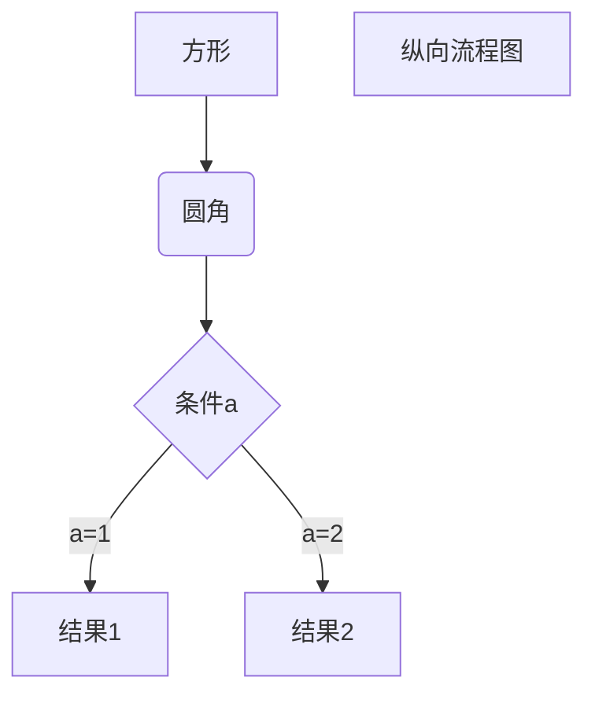

## 货币宽松政策(easymoney policy)

`货币宽松`就是指通过降低利率以提升货币供应的一种政策。
`再贴现率(Rediscount Rate)`

公开市场操作(非借入准备金的变动)
美联储放款(借入准备金的变动)

- `非借入准备金(NBR)`美联储公开市场操作所供给的准备金
- `借入准备金(BR)`向美联储借款所形成的准备金，其主要成本在于美联储会向这些贷款所收取的利率(即贴现率(*i*d))，

资产负债表
准备金规模

货币供给的变动会影响*利率*及*通货膨胀率*
- `利率`
- `通货膨胀率`

准备金市场
债券市场

准备金总额包含：(1) 法定准备金，**法定准备金率**乘以需要缴纳**准备金的存款**；(2) 超额准备金，银行自愿持有的额外的准备金。

机会成本(opportunity cost)

货币供给过程中的三位参与者
`中央银行`。政府机构，监管银行体系，负责实施货币政策。如美国的联邦储备体系
`银行`。金融中介机构(如商业银行、储蓄与贷款协会呢、互助储蓄银行及信用社)，从个人或者机构手中吸收存款或者向他们发放贷款
`储户`。拥有银行存储的个人或者机构

## 美联储的资产负债表
资产负债表
|      资产        |负债|
|-----------------|----------|
|证券              |流通中的现金|
|向金融机构发放的贷款|准备金|

### 负债
**货币负债(monetary liabilities)**，以上资产负债表中的`流通中的现金`以及`准备金`被称为美联储的货币负债。是*货币供给*的重要组成部分。货币负债与货币供给正相关

**基础货币(monetary base)**，也称**高能货币(high-powered money)**，是指<u>美联储</u>的货币负债总额(流通中的现金与准备金之和)与<u>美国财政部</u>的货币负债(流通中的财政货币，主要是筹币)。
    
    说明：一般来说，讨论基础货币，关注的主要就是美联储的货币负债，因为美国财政部的货币负债仅占基础货币的不足10%

#### 货币供给的组成部分

### 资产

